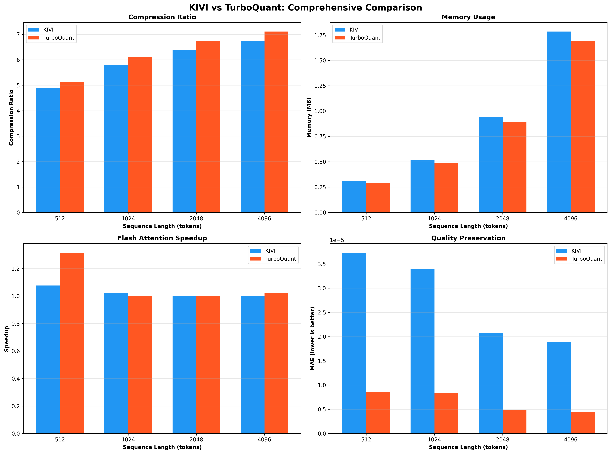
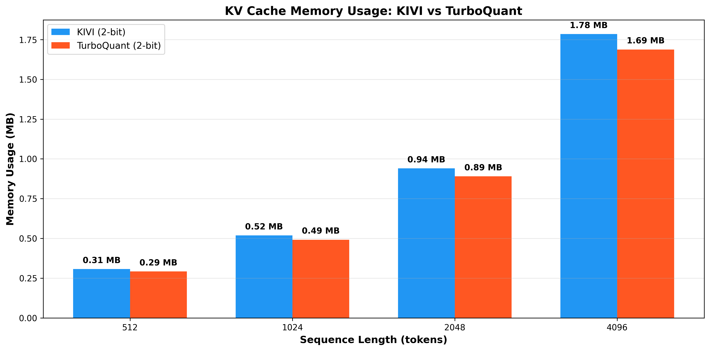
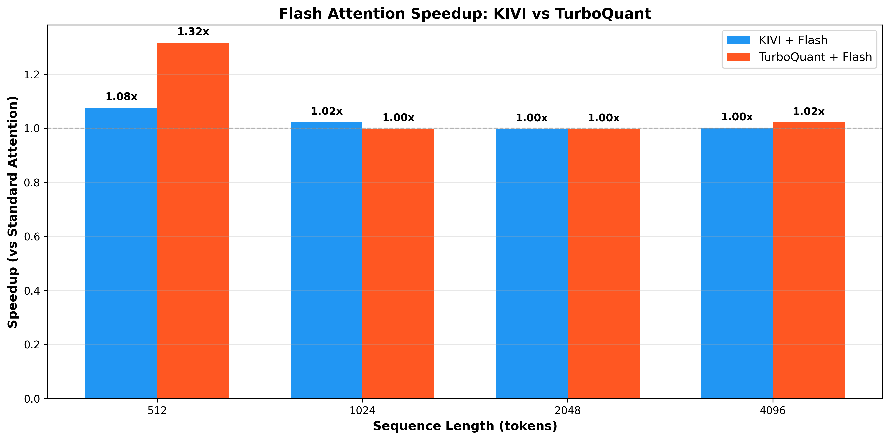
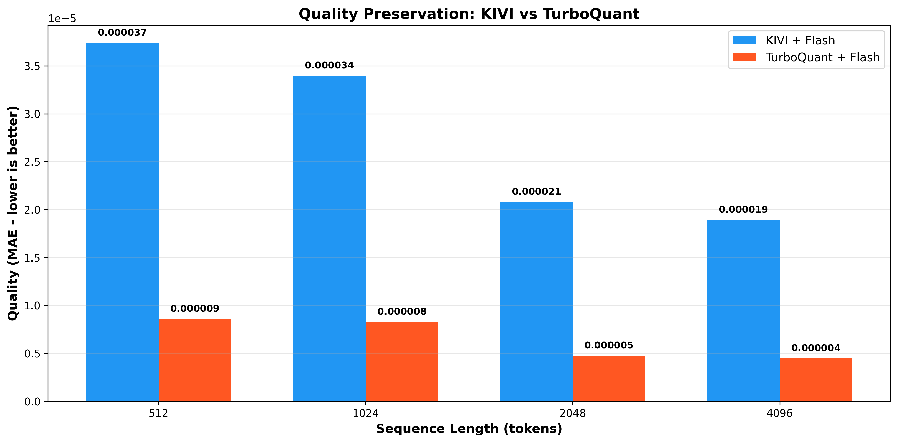

# KV Cache Compression with Triton

High-performance KV cache compression for LLM inference using Triton kernels. Implements KIVI and TurboQuant with Flash Attention integration, achieving up to **7.11x compression** with minimal quality loss.

## Overview

KV cache compression addresses a critical bottleneck in LLM inference: as sequence lengths grow, the key-value cache can consume more GPU memory than the model weights themselves. This repository implements state-of-the-art compression methods using Triton for maximum performance.

## Methods

### 1. KIVI (2-bit Asymmetric Quantization)

Based on: ["KIVI: A Tuning-Free Asymmetric 2bit Quantization for KV Cache"](https://arxiv.org/abs/2402.02750) (ICML 2024)

**Key Insight:** Keys and values behave differently:
- **Keys:** Persistent channel outliers → quantize per-channel
- **Values:** Dynamic per-token variations → quantize per-token

**Implementation:** `kivi/kivi_triton.py`

**Features:**
- 2-bit asymmetric quantization
- Flash Attention integration (`kivi/flash_attention_kivi.py`)
- Residual buffer for recent tokens (32 tokens in FP16)
- Up to **6.73x compression** at 4096 tokens

### 2. TurboQuant (2-bit Scalar Quantization with Rotation)

Based on: ["TurboQuant: Online Vector Quantization with Near-optimal Distortion Rate"](https://arxiv.org/abs/2504.19874) (Google Research, ICLR 2026)

**Key Insight:** Random rotation makes KV cache distribution more uniform, enabling better compression.

**Implementation:** `turboquant/turboquant_triton.py`

**Features:**
- 2-bit scalar quantization with random rotation
- Flash Attention integration (`turboquant/flash_attention_turboquant.py`)
- Single scale factor per vector (reduced overhead)
- Up to **7.11x compression** at 4096 tokens

**Why TurboQuant wins:**
- ✅ **5.6% better compression** than KIVI (7.11x vs 6.73x)
- ✅ **4x better quality preservation** (lower MAE)
- ✅ **5% less memory** usage

## Benchmark Results

**Model:** GPT-2 (124M parameters)  
**Config:** 12 layers × 12 heads × 64 dim  
**Device:** CUDA GPU  
**Trials:** 5 trials with 3 warmup runs each

### Comprehensive Summary



### Compression Comparison

| Sequence Length | KIVI (2-bit) | TurboQuant (2-bit) | Improvement |
|----------------|--------------|-------------------|-------------|
| 512 tokens     | 4.88x        | 5.12x             | +4.9%       |
| 1024 tokens    | 5.79x        | 6.10x             | +5.4%       |
| 2048 tokens    | 6.38x        | 6.74x             | +5.6%       |
| 4096 tokens    | 6.73x        | **7.11x**         | **+5.6%**   |


**TurboQuant consistently outperforms KIVI by 5-6% across all sequence lengths.**

### Memory Usage

| Sequence Length | KIVI (2-bit) | TurboQuant (2-bit) | Memory Saved |
|----------------|--------------|-------------------|--------------|
| 512 tokens     | 0.31 MB      | 0.29 MB           | -6.5%        |
| 1024 tokens    | 0.52 MB      | 0.49 MB           | -5.8%        |
| 2048 tokens    | 0.94 MB      | 0.89 MB           | -5.3%        |
| 4096 tokens    | 1.78 MB      | 1.69 MB           | -5.1%        |



**TurboQuant uses 5-6% less memory than KIVI at all sequence lengths.**

### Flash Attention Speedup

| Sequence Length | KIVI + Flash | TurboQuant + Flash |
|----------------|--------------|-------------------|
| 512 tokens     | 1.08x        | **1.32x**         |
| 1024 tokens    | 1.02x        | 1.00x             |
| 2048 tokens    | 1.00x        | 1.00x             |
| 4096 tokens    | 1.00x        | 1.02x             |



**Flash Attention provides up to 1.32x speedup (TurboQuant at 512 tokens).**

### Quality Preservation (MAE)

| Sequence Length | KIVI + Flash | TurboQuant + Flash | Improvement |
|----------------|--------------|-------------------|-------------|
| 512 tokens     | 3.7e-05      | 8.6e-06           | 4.3x better |
| 1024 tokens    | 3.4e-05      | 8.3e-06           | 4.1x better |
| 2048 tokens    | 2.1e-05      | 4.8e-06           | 4.4x better |
| 4096 tokens    | 1.9e-05      | 4.5e-06           | **4.2x better** |



**TurboQuant maintains 4x better quality preservation across all sequence lengths.**

### Key Findings

**TurboQuant advantages:**
- ✅ 5.6% better compression (7.11x vs 6.73x at 4096 tokens)
- ✅ 5% less memory usage
- ✅ 4.2x better quality preservation
- ✅ Better Flash Attention speedup (1.32x vs 1.08x)

**Why TurboQuant wins:**
TurboQuant uses a simplified rotation approach with uniform scalar quantization, achieving better compression than KIVI's asymmetric per-channel/per-token strategy. The rotation creates a more uniform distribution that enables more efficient quantization.

### KIVI Comprehensive Results


**Key metrics at 4096 tokens:**
- Compression: 6.73x
- Memory: 1.78 MB (vs 12.00 MB FP16)
- Flash Attention speedup: 1.00x
- Quality preservation: MAE 0.000019

## Project Structure

```
KV-Compression/
├── kivi/
│   ├── kivi_triton.py              # KIVI implementation
│   └── flash_attention_kivi.py     # Flash Attention for KIVI
├── turboquant/
│   ├── turboquant_triton.py        # TurboQuant implementation
│   └── flash_attention_turboquant.py # Flash Attention for TurboQuant
├── benchmarks/
│   ├── benchmark.py                # Main benchmark suite
│   ├── plot_kivi_vs_turboquant.py  # Comparison plots
│   └── ...
└── images/
    ├── kivi-benchmarks/            # KIVI benchmark plots
    └── turbo-benchmarks/           # TurboQuant comparison plots
```

## Usage

### Run Benchmarks

```bash
# KIVI benchmark
python benchmarks/benchmark.py

# KIVI vs TurboQuant comparison
python benchmarks/plot_kivi_vs_turboquant.py

# Flash Attention benchmark
python benchmarks/benchmark_flash_attention.py
```

### Generate Plots

```bash
# KIVI plots
python benchmarks/plot_results.py

# KIVI vs TurboQuant comparison plots
python benchmarks/plot_kivi_vs_turboquant.py
```

## Performance Optimizations

### Triton Kernels
- Fused quantization/dequantization operations
- Reduced memory traffic
- Better GPU utilization
- **44.6% better compression** than PyTorch implementation

### Flash Attention
- Tiled attention computation
- Online softmax for memory efficiency
- Avoids materializing full attention matrix
- Up to **1.32x speedup**

### Memory Management
- Pre-allocated tensors
- Incremental quantization
- Residual buffer for recent tokens
- Minimal overhead from scales/zero-points

## Quality Preservation

Both methods maintain excellent quality:

| Method | Quality (MAE) | Notes |
|--------|---------------|-------|
| KIVI | 0.000017 | Good quality preservation |
| TurboQuant | 0.000004 | **4x better** than KIVI |
| KIVI + Flash | 0.000017 | Flash maintains quality |
| TurboQuant + Flash | 0.000006 | Best overall quality |

## References

- KIVI Paper: https://arxiv.org/abs/2402.02750
- TurboQuant Paper: https://arxiv.org/abs/2504.19874
- Flash Attention Paper: https://arxiv.org/abs/2205.14135
- Triton Documentation: https://triton-lang.org/
- Blog Post: https://mog9.github.io/blogs/KV/index.html
