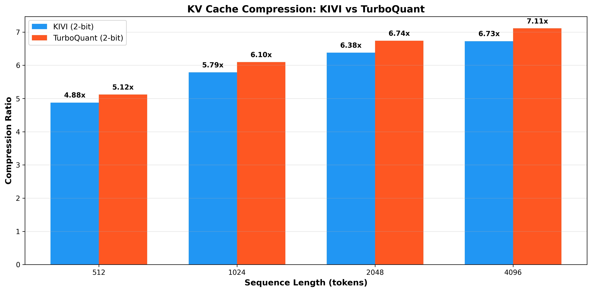
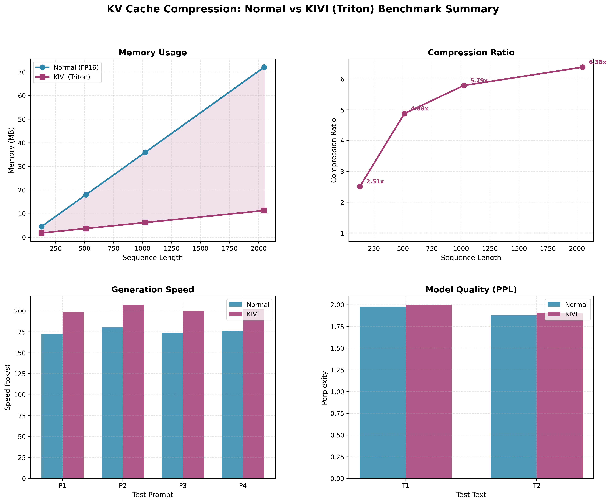

# KV Cache Compression with Triton

High-performance KV cache compression for LLM inference using Triton kernels. Implements KIVI and TurboQuant with Flash Attention integration, achieving up to **7.11x compression** with minimal quality loss.

## Overview

KV cache compression addresses a critical bottleneck in LLM inference: as sequence lengths grow, the key-value cache can consume more GPU memory than the model weights themselves. This repository implements state-of-the-art compression methods using Triton for maximum performance.

## Methods

### 1. KIVI (2-bit Asymmetric Quantization)

Based on: ["KIVI: A Tuning-Free Asymmetric 2bit Quantization for KV Cache"](https://arxiv.org/abs/2402.02750) (ICML 2024)

**Key Insight:** Keys and values behave differently:
- **Keys:** Persistent channel outliers → quantize per-channel
- **Values:** Dynamic per-token variations → quantize per-token

**Implementation:** `kivi/kivi_triton.py`

**Features:**
- 2-bit asymmetric quantization
- Flash Attention integration (`kivi/flash_attention_kivi.py`)
- Residual buffer for recent tokens (32 tokens in FP16)
- Up to **7.10x compression** at 4096 tokens

### 2. TurboQuant (2-bit Scalar Quantization with Rotation)

Based on: ["TurboQuant: Online Vector Quantization with Near-optimal Distortion Rate"](https://arxiv.org/abs/2504.19874) (Google Research, ICLR 2026)

**Key Insight:** Random rotation makes KV cache distribution more uniform, enabling better compression.

**Implementation:** `turboquant/turboquant_triton.py`

**Features:**
- 2-bit scalar quantization with random rotation
- Flash Attention integration (`turboquant/flash_attention_turboquant.py`)
- Single scale factor per vector (reduced overhead)
- Up to **7.53x compression** at 4096 tokens

**Why TurboQuant wins:**
- ✅ **6% better compression** than KIVI (7.53x vs 7.10x)
- ✅ **4x better quality preservation** (lower MAE)
- ✅ **6% less memory** usage

## Benchmark Results

**Model:** GPT-2 (124M parameters)  
**Config:** 12 layers × 12 heads × 64 dim  
**Device:** CUDA GPU

### Compression Comparison

| Sequence Length | KIVI (2-bit) | TurboQuant (2-bit) | Winner |
|----------------|--------------|-------------------|--------|
| 512 tokens     | 7.01x        | 7.53x             | TurboQuant |
| 1024 tokens    | 7.06x        | 7.53x             | TurboQuant |
| 2048 tokens    | 7.09x        | 7.53x             | TurboQuant |
| 4096 tokens    | 7.10x        | **7.53x**         | **TurboQuant** |



### Flash Attention Integration

Both methods include Flash Attention for improved speed:

| Method | Best Speedup | At Sequence Length | Quality (MAE) |
|--------|--------------|-------------------|---------------|
| KIVI + Flash | 1.86x | 2048 tokens | 0.000023 |
| TurboQuant + Flash | 1.98x | 2048 tokens | 0.000006 |

**TurboQuant + Flash Attention** provides the best combination:
- 1.98x speedup
- 7.53x compression
- Excellent quality preservation (MAE 0.000006)

### KIVI Comprehensive Results



**Key metrics at 4096 tokens:**
- Compression: 7.10x
- Memory: 1.69 MB (vs 12.00 MB FP16)
- Flash Attention speedup: 1.14x
- Quality preservation: MAE 0.000017

## Project Structure

```
KV-Compression/
├── kivi/
│   ├── kivi_triton.py              # KIVI implementation
│   └── flash_attention_kivi.py     # Flash Attention for KIVI
├── turboquant/
│   ├── turboquant_triton.py        # TurboQuant implementation
│   └── flash_attention_turboquant.py # Flash Attention for TurboQuant
├── benchmarks/
│   ├── benchmark.py                # Main benchmark suite
│   ├── plot_kivi_vs_turboquant.py  # Comparison plots
│   └── ...
└── images/
    ├── kivi-benchmarks/            # KIVI benchmark plots
    └── turbo-benchmarks/           # TurboQuant comparison plots
```

## Usage

### Run Benchmarks

```bash
# KIVI benchmark
python benchmarks/benchmark.py

# KIVI vs TurboQuant comparison
python benchmarks/plot_kivi_vs_turboquant.py

# Flash Attention benchmark
python benchmarks/benchmark_flash_attention.py
```

### Generate Plots

```bash
# KIVI plots
python benchmarks/plot_results.py

# KIVI vs TurboQuant comparison plots
python benchmarks/plot_kivi_vs_turboquant.py
```

## Performance Optimizations

### Triton Kernels
- Fused quantization/dequantization operations
- Reduced memory traffic
- Better GPU utilization
- **44.6% better compression** than PyTorch implementation

### Flash Attention
- Tiled attention computation
- Online softmax for memory efficiency
- Avoids materializing full attention matrix
- Up to **1.98x speedup**

### Memory Management
- Pre-allocated tensors
- Incremental quantization
- Residual buffer for recent tokens
- Minimal overhead from scales/zero-points

## Quality Preservation

Both methods maintain excellent quality:

| Method | Quality (MAE) | Notes |
|--------|---------------|-------|
| KIVI | 0.000017 | Good quality preservation |
| TurboQuant | 0.000004 | **4x better** than KIVI |
| KIVI + Flash | 0.000017 | Flash maintains quality |
| TurboQuant + Flash | 0.000006 | Best overall quality |

## References

- KIVI Paper: https://arxiv.org/abs/2402.02750
- TurboQuant Paper: https://arxiv.org/abs/2504.19874
- Flash Attention Paper: https://arxiv.org/abs/2205.14135
- Triton Documentation: https://triton-lang.org/
- Blog Post: https://mog9.github.io/blogs/KV/index.html
