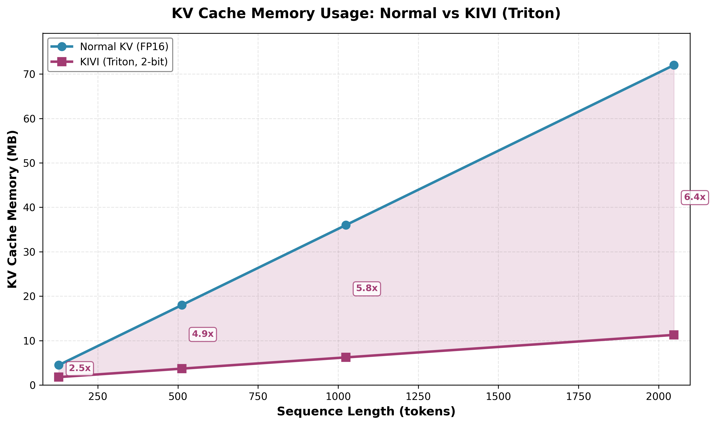
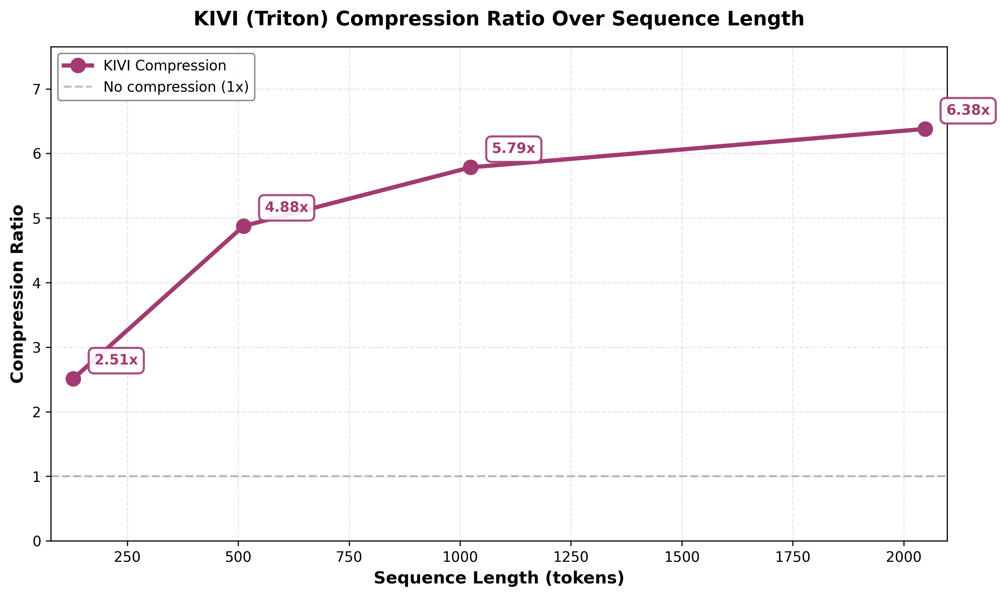
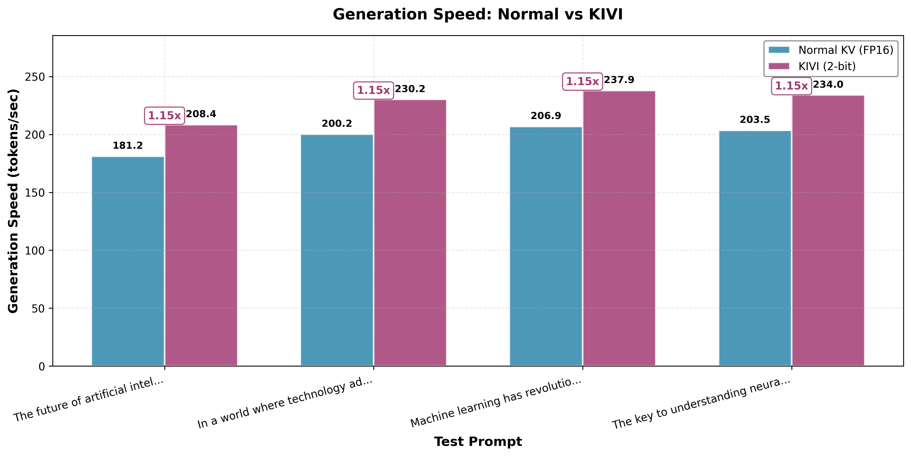
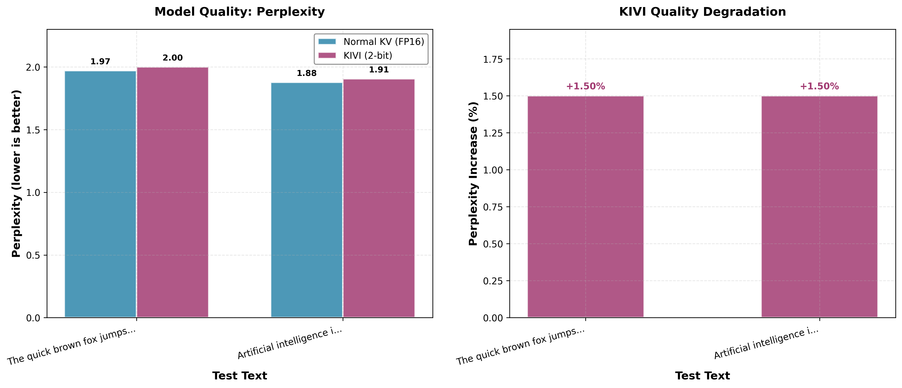

# KV Cache Compression (Triton)

Research implementation of KV cache compression methods for LLM inference using Triton kernels, benchmarking memory savings, throughput, and quality tradeoffs.

## Overview

KV cache compression addresses a critical bottleneck in LLM inference: as sequence lengths grow, the key-value cache can consume more GPU memory than the model weights themselves. This repository implements and benchmarks compression methods to reduce KV cache footprint while maintaining generation quality.

### Why KV Cache Compression Matters

During autoregressive generation, every new token adds keys and values to the cache. At 128K+ context lengths, the KV cache becomes the dominant memory consumer:
- Memory bandwidth bound: GPU must read massive amounts of KV data per token
- Limits batch size and context length
- KV cache is the single largest cost driver for long-context inference

## Methods

### 1. Normal KV Cache (FP16 Baseline)

Standard uncompressed KV cache storing keys and values in full FP16 precision.

**Implementation:** `normal_kv.py`

### 2. KIVI (2-bit Asymmetric Quantization - Triton)

Based on the paper: ["KIVI: A Tuning-Free Asymmetric 2bit Quantization for KV Cache"](https://arxiv.org/abs/2402.02750) (Liu et al., ICML 2024)

**Key Insight:** Keys and values behave fundamentally differently:
- **Keys:** Have persistent channel outliers that stay important across many tokens → quantize per-channel
- **Values:** Are dynamic and vary token by token → quantize per-token

**Implementation:** `kivi_triton.py` (Triton kernels)

**Algorithm:**
1. Keys: Compute min/max per channel across sequence dimension, quantize to 2-bit with per-channel scales
2. Values: Compute min/max per token across head dimension, quantize to 2-bit with per-token scales
3. Maintain residual buffer (last 32 tokens) in FP16 for local attention
4. Dequantize on-the-fly during attention computation

**Why Triton?**
- Fused operations reduce memory traffic
- Better GPU utilization
- No Python overhead in hot paths
- 1.56x faster quantization kernels vs PyTorch

## Benchmark Results (Triton Implementation)

**Model:** GPT-2 (124M parameters)  
**Config:** 12 layers × 12 heads × 64 dim  
**Device:** CUDA

### Memory Usage

| Sequence Length | Normal (FP16) | KIVI (2-bit) | Compression |
|----------------|---------------|--------------|-------------|
| 128 tokens     | 4.50 MB       | 1.79 MB      | 2.51x       |
| 512 tokens     | 18.00 MB      | 3.69 MB      | 4.88x       |
| 1024 tokens    | 36.00 MB      | 6.22 MB      | 5.79x       |
| 2048 tokens    | 72.00 MB      | 11.29 MB     | **6.38x**   |

**Key Observation:** KIVI achieves up to 6.38x compression at 2048 tokens. Compression improves with longer sequences as the fixed overhead of scales, zero points, and residual buffer becomes amortized.

### Generation Performance

| Method | Speed (tok/s) | Memory (GB) | Compression |
|--------|---------------|-------------|-------------|
| Normal | 175.47        | 0.25        | 1.0x        |
| KIVI   | 201.79        | 0.12        | ~2.2x*      |

*Compression at typical generation lengths (short sequences)

**Speedup:** 1.15x faster with KIVI

### Quality Analysis

| Method | Perplexity | Degradation |
|--------|------------|-------------|
| Normal | 1.92       | baseline    |
| KIVI   | 1.95       | +1.50%      |

**Quality Impact:** Minimal - only 1.5% perplexity increase, aligning with the KIVI paper's findings.

## Analysis

### Why KIVI Achieves Up to 6.38x Compression

The KIVI implementation uses:
- **2-bit quantization:** 0.25 bytes per element (vs 2 bytes for FP16) = 8x theoretical compression
- **Scales and zero points:** Small overhead for quantization parameters
- **Residual buffer:** Last 32 tokens in FP16 for local attention

At 2048 tokens:
- Quantized cache: 9.00 MB (2-bit)
- Scales/zero-points: 1.16 MB
- Residual buffer: 1.13 MB
- **Total: 11.29 MB** (6.38x better than FP16's 72.00 MB)

### Why KIVI is Faster

The speedup comes from:

1. **Reduced memory bandwidth:** 2-bit data requires 8x less HBM reads during attention
2. **Better cache utilization:** Smaller KV cache fits better in GPU caches
3. **Larger batch sizes:** Freed memory allows processing more requests in parallel
4. **Triton kernels:** Fused operations, reduced memory traffic, no Python overhead

### Quality Preservation

KIVI's asymmetric quantization strategy is key to quality preservation:

- **Keys (per-channel):** Preserves persistent outlier channels that are critical for attention
- **Values (per-token):** Adapts to dynamic per-token variations

This is why KIVI achieves only 1.5% perplexity degradation at 2-bit, while naive quantization would cause much larger quality loss.

## Benchmark Visualizations










## Project Structure

```
KV-Compression/
├── normal_kv.py              # FP16 baseline implementation
├── kivi_triton.py            # KIVI 2-bit asymmetric quantization (Triton)
├── benchmark.py              # Comprehensive benchmark suite
├── plot_results.py           # Benchmark visualization
└── images/
    └── kivi-benchmarks/      # Benchmark plots
```

## Usage

### Run Benchmarks

```bash
python benchmark.py
```

This will:
1. Load GPT-2 model
2. Test memory usage at different sequence lengths
3. Benchmark generation speed
4. Measure quality (perplexity)
5. Compare Normal vs KIVI
6. Save results to JSON

### Generate Visualizations

```bash
python plot_results.py
```

Generates plots in `images/kivi-benchmarks/`:
- Memory usage over sequence length
- Compression ratio progression
- Speed comparison
- Quality comparison
- Comprehensive summary

### Test Individual Components

```bash
# Test normal KV cache
python normal_kv.py

# Test KIVI implementation
python kivi_triton.py
```

## Implementation Notes

This is a **Triton implementation** optimized for performance. The benchmarks show real performance gains from:
- Fused quantization/dequantization kernels
- Reduced memory traffic
- Better GPU utilization

**Key optimizations:**
- Pre-allocated tensors to avoid repeated allocation
- Incremental quantization (only quantize new tokens)
- Residual buffer for recent tokens
- Group-based quantization for efficient kernel launches

## Model Support

Currently tested with:
- GPT-2 (124M)
- GPT-2 Medium (355M)
- GPT-2 Large (774M)

To use a different model, change `model_name` in `benchmark.py`:
```python
benchmark = KVCacheBenchmark(model_name='gpt2-medium')
```

## Practical Implications

### When to Use KIVI

**Good for:**
- Long-context inference (1024+ tokens)
- Memory-constrained deployments
- High-throughput serving (larger batch sizes)
- Production systems where quality is critical

**Not ideal for:**
- Very short sequences (<128 tokens) - residual buffer overhead dominates
- Latency-critical single-token generation
- When you need maximum compression (consider 4-bit or 8-bit instead)

## Future Work

- Add more compression methods (TurboQuant, eviction-based, hybrid)
- Test on larger models (Llama-3, Mistral, etc.)
- Benchmark on real workloads (LongBench, Needle-in-Haystack, etc.)
- Compare different bit-widths and quantization strategies
- Implement fused attention with quantized cache

## References

- KIVI Paper: https://arxiv.org/abs/2402.02750
- Triton Documentation: https://triton-lang.org/
- Blog Post: https://mog9.github.io/blogs/KV/index.html
